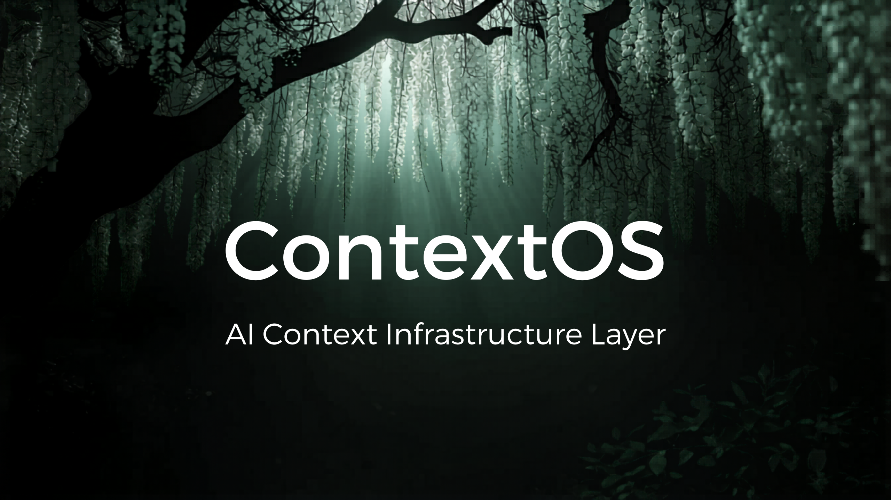

<div align="center">

<<<<<<< HEAD

=======

>>>>>>> 79d533911cc40970e5bf7918589b6cc75c526fe5

<br/>

[](LICENSE)
[](https://python.org)
[]()
[]()
[](CONTRIBUTING.md)
[](https://pypi.org/project/contextos-cli/)

<br/>

### 🌿 *Stop repeating yourself to AI. Let ContextOS remember.* 🌿

<br/>

[**Getting Started**](#-install) · [**CLI Commands**](#-cli-commands) · [**How It Works**](#-how-it-works) · [**Roadmap**](#-roadmap) · [**Contributing**](#-contributing)

<br/>

</div>

---

## 🤔 The Problem

Every AI session starts from zero.

You explain your project. Again.
You explain what's done. Again.
You explain the constraints. Again.

Meanwhile the AI burns hundreds of tokens just reading context it already processed yesterday.

**There had to be a better way.**

---

## ⚡ The Solution

<div align="center">

```
Without ContextOS                    With ContextOS
─────────────────                    ──────────────
You → [entire codebase]              You → ContextOS → [45 tokens]
    → [full history]                             ↓
    → [repeated rules]               Compressed. Focused. Structured.
    → AI Model                       → AI Model

    ~3000 tokens                     ~45 tokens
```

</div>

ContextOS sits between you and any AI model. It maintains structured project memory and injects only what the AI needs — nothing more.

---

## 🔥 Why ContextOS?

<table>
<tr>
<td width="50%">

### ❌ Without ContextOS
- Repeat project context every session
- AI loses track of current task
- No record of decisions made
- Token waste on irrelevant history
- Hard dependency on AI frameworks

</td>
<td width="50%">

### ✅ With ContextOS
- Automatic context injection
- Persistent task state
- Full decision history
- 70%+ token reduction
- Delete `.contextos/` — completely gone

</td>
</tr>
</table>

---

## 📦 Install

```bash
pip install contextos-cli
```

Or from source:

```bash
git clone https://github.com/Whynotshashwat/ContextOS.git
cd ContextOS
python -m venv .venv

# Windows
.venv\Scripts\activate

# Mac/Linux
source .venv/bin/activate

pip install -e .
```

Verify:
```bash
context --help
```

---

## 🚀 Quick Start

```bash
# 1. Initialize in your project
context init "Jarvis" "Build an AI voice assistant"

# 2. Check project state
context status

# 3. Break task into subtasks
context decompose 1

# 4. Get next task
context next

# 5. See exactly what AI receives
context explain

# 6. Mark task done
context done 1.1

# 7. Get A/B/C implementation approaches
context suggest 1
```

---

## 🖥 CLI Commands

| Command | Description | Example |
|---|---|---|
| `context init` | Initialize ContextOS | `context init "Jarvis" "Build AI assistant"` |
| `context status` | Show full project state | `context status` |
| `context next` | Advance to next task | `context next` |
| `context done` | Mark task complete | `context done 1.1` |
| `context decompose` | Break task into subtasks | `context decompose 1` |
| `context suggest` | Get A/B/C approaches | `context suggest 1` |
| `context explain` | Preview context injection | `context explain` |
| `context goal` | Update project goal | `context goal "New goal"` |
| `context snapshot` | Save checkpoint | `context snapshot "before refactor"` |
| `context rollback` | Restore last snapshot | `context rollback` |
| `context import` | Import from README/TODO | `context import` |

### Flags
```bash
context done 1.1 --dry-run       # Preview without executing
context decompose 1 --dry-run    # Preview subtasks before creating
```

---

## 🧠 How It Works

```
┌─────────────────────────────────────────────────────┐
│                    Your Project                      │
│                                                     │
│  ┌──────────────┐        ┌───────────────────────┐  │
│  │   You/IDE    │───────▶│      ContextOS        │  │
│  └──────────────┘        │                       │  │
│                          │  ┌─────────────────┐  │  │
│                          │  │  Context Engine  │  │  │
│                          │  │  Compressor      │  │  │
│                          │  │  Memory Store    │  │  │
│                          │  │  Decision Log    │  │  │
│                          │  └────────┬────────┘  │  │
│                          └───────────┼───────────┘  │
│                                      │              │
│                                      ▼              │
│                          ┌───────────────────────┐  │
│                          │  Compressed Context   │  │
│                          │  45 tokens (not 3000) │  │
│                          └───────────┬───────────┘  │
│                                      │              │
│                                      ▼              │
│                          ┌───────────────────────┐  │
│                          │      AI Model         │  │
│                          │  (any provider)       │  │
│                          └───────────────────────┘  │
└─────────────────────────────────────────────────────┘
```

### Context Priority Stack

ContextOS compresses context using a strict priority order:

```
Priority 1 ── Current task + subtask
Priority 2 ── Active rules
Priority 3 ── Last 3 decisions
Priority 4 ── Pending task titles
Priority 5 ── Project goal
Drop       ── Completed details, logs, cache
```

---

## 📊 Context Score

Every `context status` shows real metrics:

```
╭──────────────── ContextOS Status ─────────────────╮
│ Jarvis                                             │
│ Build an AI voice assistant                        │
╰────────────────────────────────────────────────────╯

  Field              Value
  Phase              Core Features
  Current Task       Command Parser
  Current Subtask    Map commands
  Progress           2/5 tasks done
  Context Score      90/100
```

Score breakdown:
- Project name + goal defined → +35
- Phase set → +10
- Active task + subtask → +25
- Tasks with subtasks → +20

---

## 📄 AICF — AI Context Format

ContextOS uses **AICF (AI Context Format)** — an open specification for structured AI project memory.

```json
{
  "aicf_version": "1.0",
  "project": {
    "name": "Jarvis",
    "goal": "Build an AI voice assistant",
    "description": "Voice and text AI assistant"
  },
  "state": {
    "phase": "Core Features",
    "current_task": "2",
    "current_subtask": "2.2"
  },
  "tasks": [
    {
      "id": "1",
      "title": "Project setup",
      "status": "done"
    },
    {
      "id": "2",
      "title": "Command parser",
      "status": "in_progress",
      "subtasks": [
        { "id": "2.1", "title": "Detect keywords", "status": "done" },
        { "id": "2.2", "title": "Map commands", "status": "pending" }
      ]
    }
  ],
  "rules": {
    "max_subtasks": 5,
    "execute_one_subtask_only": true
  }
}
```

Any tool can read AICF. No ContextOS dependency required.

---

## 🗂 Project Memory Structure

```
your-project/
└── .contextos/          ← isolated memory layer
    ├── aicf.json        ← project state (safe to commit)
    ├── memory.json      ← compressed history
    ├── decisions.json   ← decision log
    ├── snapshots/       ← context checkpoints
    └── logs/            ← interaction logs
```

> ⚠️ Add `config.json` to `.gitignore` — it contains your API keys.

---

## 🛡 Removal Safety

ContextOS is **fully removable** at any time:

```bash
# Remove ContextOS completely
rm -rf .contextos/
pip uninstall contextos-cli
```

Your project:
- ✅ Compiles
- ✅ Runs
- ✅ Behaves identically

Zero runtime dependency. Zero leftover code.

---

## 📈 Roadmap

```
Phase 1 — MVP          ████████████████████  Done ✅
Phase 2 — Smart Memory ░░░░░░░░░░░░░░░░░░░░  Up Next
Phase 3 — Ecosystem    ░░░░░░░░░░░░░░░░░░░░  Planned
```

- [x] Core engine
- [x] AICF schema
- [x] CLI — all commands
- [x] Context compression
- [x] Decision tracking
- [x] A/B/C suggestion engine
- [x] Snapshot and rollback
- [x] Context import
- [x] Context score
- [x] Python SDK
- [ ] JavaScript SDK
- [ ] VS Code extension
- [ ] Antigravity integration
- [ ] Team shared memory
- [ ] Cloud sync

---

## 🤝 Contributing

Contributions are welcome.

```bash
# Fork the repo
git clone https://github.com/YOURUSERNAME/ContextOS.git
cd ContextOS
python -m venv .venv
.venv\Scripts\activate
pip install -e .

# Create your branch
git checkout -b feature/your-feature

# Make changes and push
git push origin feature/your-feature
```

See [CONTRIBUTING.md](CONTRIBUTING.md) for guidelines.

---

## 📜 License

Apache 2.0 — see [LICENSE](LICENSE)

Free for personal and commercial use.

---

<div align="center">


**Built with 🌿 by [Whynotshashwat](https://github.com/Whynotshashwat)**

*If ContextOS helped you — give it a ⭐*

</div>
