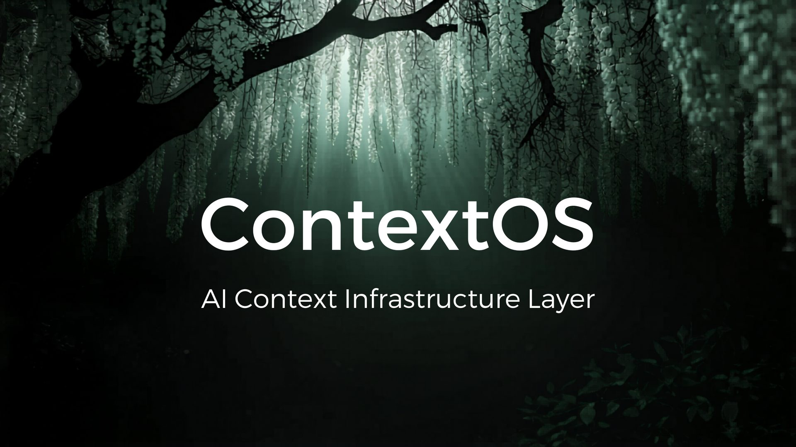

<div align="center">



<br/>

[](LICENSE)
[](https://python.org)
[](https://nodejs.org)
[]()
[](https://github.com/Whynotshashwat/ContextOS/actions)
[](https://pypi.org/project/contextos-cli/)
[](CONTRIBUTING.md)

<br/>

### 🌿 *Stop repeating yourself to AI. Let ContextOS remember.* 🌿

<br/>

[**Getting Started**](#-install) · [**CLI Commands**](#-cli-commands) · [**MCP Integration**](#-mcp-integration) · [**JavaScript SDK**](#-install) · [**How It Works**](#-how-it-works) · [**Roadmap**](#-roadmap) · [**Contributing**](#-contributing)

<br/>

</div>

---

## 🤔 The Problem

Every AI session starts from zero.

You explain your project. Again.
You explain what's done. Again.
You explain the constraints. Again.

Meanwhile the AI burns hundreds of tokens just reading context it already processed yesterday.

**There had to be a better way.**

---

## ⚡ The Solution

<div align="center">

```
Without ContextOS                    With ContextOS
─────────────────                    ──────────────
You → [entire codebase]              You → ContextOS → [52 tokens]
    → [full history]                             ↓
    → [repeated rules]               Compressed. Focused. Structured.
    → AI Model                       → AI Model

    ~3000 tokens                     ~52 tokens
```

</div>

ContextOS sits between you and any AI model. It maintains structured project memory and injects only what the AI needs — nothing more.

---

## 🔥 Why ContextOS?

<table>
<tr>
<td width="51%">

### ❌ Without ContextOS
- Repeat project context every session
- AI loses track of current task
- No record of decisions made
- Token waste on irrelevant history
- Hard dependency on AI frameworks

</td>
<td width="50%">

### ✅ With ContextOS
- Automatic context injection
- Persistent task state
- Full decision history
- 70%+ token reduction
- Delete `.contextos/` — completely gone

</td>
</tr>
</table>

---

## 📦 Install

```bash
pip install contextos-cli
```

Or from source:

```bash
git clone https://github.com/Whynotshashwat/ContextOS.git
cd ContextOS
python -m venv .venv

# Windows
.venv\Scripts\activate

# Mac/Linux
source .venv/bin/activate

pip install -e .
```

Verify:
```bash
context --help
```

### JavaScript SDK

```bash
npm install @contextos/sdk
```

```js
import { ContextOS } from '@contextos/sdk';

const sdk = new ContextOS('/path/to/project');
const prompt = await sdk.inject('implement auth for the admin panel');
console.log(prompt);
```

Requires Node.js >= 18. See [`sdk/js/README.md`](sdk/js/README.md) for the full API.

---

## 🚀 Quick Start

```bash
# 1. Initialize in your project
context init "Jarvis" "Build an AI voice assistant"

# 2. Check project state
context status

# 3. Break task into subtasks
context decompose 1

# 4. Get next task
context next

# 5. See exactly what AI receives
context explain

# 6. Mark task done
context done 1.1

# 7. Get A/B/C implementation approaches
context suggest 1
```

---

## 🖥 CLI Commands

| Command | Description | Example |
|---|---|---|
| `context init` | Initialize ContextOS | `context init "Jarvis" "Build AI assistant"` |
| `context status` | Show full project state | `context status` |
| `context next` | Advance to next task | `context next` |
| `context done` | Mark task complete | `context done 1.1` |
| `context decompose` | Break task into subtasks | `context decompose 1` |
| `context suggest` | Get A/B/C approaches | `context suggest 1` |
| `context explain` | Preview context injection | `context explain` |
| `context goal` | Update project goal | `context goal "New goal"` |
| `context snapshot` | Save checkpoint | `context snapshot "before refactor"` |
| `context rollback` | Restore last snapshot | `context rollback` |
| `context import` | Import from README/TODO | `context import` |
| `context stats` | Show honest usage stats | `context stats --baseline 4000` |
| `context log` | View interaction log | `context log` |
| `context compress` | Compress context history | `context compress` |
| `context ignore init` | Create .contextosignore | `context ignore init` |
| `context ignore list` | List ignore rules | `context ignore list` |
| `context config set` | Set provider/model/agent | `context config set model gpt-4o` |
| `context config show` | Show current config | `context config show` |

### Flags
```bash
context done 1.1 --dry-run       # Preview without executing
context decompose 1 --dry-run    # Preview subtasks before creating
context stats --baseline 4000    # Show reduction with your baseline
```

---

## 🔌 MCP Integration

ContextOS runs as an MCP server — connecting natively to Claude Code, Cursor, and any MCP-compatible agent.

### Setup for Claude Code

Add to your Claude Code MCP config:

**Windows:** `%APPDATA%\Claude\claude_desktop_config.json`
**Mac/Linux:** `~/.config/claude/claude_desktop_config.json`

```json
{
  "mcpServers": {
    "contextos": {
      "command": "python",
      "args": ["-m", "integrations.mcp.server"],
      "cwd": "C:/path/to/your/project"
    }
  }
}
```

### What Claude Code Can Do With ContextOS

Once connected, Claude Code automatically:
- Knows your current task and subtask
- Reads your project decisions
- Marks tasks done after completing them
- Gets compressed context before every response

```
You: What should I work on next?
Claude Code: [calls get_next_task] → Task 1.2: Install dependencies

You: I finished that.
Claude Code: [calls mark_done 1.2] → Done. Next: Configure environment
```

### Available MCP Tools

| Tool | Description |
|---|---|
| `get_current_task` | Active task and subtask |
| `get_next_task` | Next pending task |
| `get_status` | Full project status |
| `get_context` | Compressed context for a prompt |
| `explain_context` | Preview context injection |
| `mark_done` | Mark task complete |
| `decompose_task` | Break task into subtasks |
| `get_suggestions` | A/B/C implementation options |
| `record_decision` | Save A/B/C decision |
| `get_stats` | Project statistics |
| `take_snapshot` | Save checkpoint |
| `get_decisions` | View all decisions |

---

## 🧠 How It Works

```
┌─────────────────────────────────────────────────────┐
│                    Your Project                      │
│                                                     │
│  ┌──────────────┐        ┌───────────────────────┐  │
│  │   You/IDE    │───────▶│      ContextOS        │  │
│  └──────────────┘        │                       │  │
│                          │  ┌─────────────────┐  │  │
│                          │  │  Context Engine  │  │  │
│                          │  │  Compressor      │  │  │
│                          │  │  Memory Store    │  │  │
│                          │  │  Decision Log    │  │  │
│                          │  └────────┬────────┘  │  │
│                          └───────────┼───────────┘  │
│                                      │              │
│                                      ▼              │
│                          ┌───────────────────────┐  │
│                          │  Compressed Context   │  │
│                          │  52 tokens (not 3000) │  │
│                          └───────────┬───────────┘  │
│                                      │              │
│                                      ▼              │
│                          ┌───────────────────────┐  │
│                          │  AI Model / MCP Agent │  │
│                          │  (any provider)       │  │
│                          └───────────────────────┘  │
└─────────────────────────────────────────────────────┘
```

### Context Priority Stack

```
Priority 1 ── Current task + subtask
Priority 2 ── Active rules
Priority 3 ── Last 3 decisions
Priority 4 ── Pending task titles
Priority 5 ── Project goal
Drop       ── Completed details, logs, cache
```

---

## 📊 Context Score

Every `context status` shows real metrics:

```
╭──────────────── ContextOS Status ─────────────────╮
│ Jarvis                                             │
│ Build an AI voice assistant                        │
╰────────────────────────────────────────────────────╯

  Field              Value
  Phase              Core Features
  Current Task       Command Parser
  Current Subtask    Map commands
  Progress           2/5 tasks done
  Context Score      90/100
```

---

## 📄 AICF — AI Context Format

ContextOS uses **AICF (AI Context Format)** — an open specification for structured AI project memory. Any tool can read it without needing ContextOS.

```json
{
  "aicf_version": "1.0",
  "project": {
    "name": "Jarvis",
    "goal": "Build an AI voice assistant"
  },
  "state": {
    "phase": "Core Features",
    "current_task": "2",
    "current_subtask": "2.2"
  },
  "tasks": [
    { "id": "1", "title": "Project setup", "status": "done" },
    {
      "id": "2",
      "title": "Command parser",
      "status": "in_progress",
      "subtasks": [
        { "id": "2.1", "title": "Detect keywords", "status": "done" },
        { "id": "2.2", "title": "Map commands", "status": "pending" }
      ]
    }
  ],
  "rules": {
    "max_subtasks": 5,
    "execute_one_subtask_only": true
  }
}
```

---

## 🗂 Project Memory Structure

```
your-project/
├── .contextosignore     ← what to exclude from context
└── .contextos/          ← isolated memory layer
    ├── aicf.json        ← project state (safe to commit)
    ├── memory.json      ← compressed history
    ├── decisions.json   ← decision log
    ├── snapshots/       ← context checkpoints
    └── logs/            ← interaction logs
```

---

## 🛡 Removal Safety

```bash
rm -rf .contextos/
pip uninstall contextos-cli
```

Your project compiles, runs, and behaves identically. Zero runtime dependency.

---

## 📈 Roadmap

```
Phase 1 — MVP          ████████████████████  Done ✅
Phase 2 — Smart Memory ████████████████████  Done ✅
Phase 3 — Ecosystem    ████░░░░░░░░░░░░░░░░  In Progress (1/4)
```

### ✅ Done

- [x] Core engine + AICF schema
- [x] CLI — 18 commands
- [x] Context compression
- [x] Decision tracking
- [x] A/B/C suggestion engine
- [x] Snapshot and rollback
- [x] Context import
- [x] Context score
- [x] Python SDK
- [x] JavaScript SDK (`@contextos/sdk`, Node >= 18)
- [x] Honest stats engine
- [x] .contextosignore support
- [x] MCP server — Claude Code + Cursor integration
- [x] GitHub Actions CI/CD
- [x] 113 passing tests (Python) + 28 passing tests (JS SDK)

### 🚧 In Progress

- [ ] VS Code extension — plain `tsc` extension reusing `@contextos/sdk`, with tree view, status bar, and ~8 palette commands
- [ ] Team shared memory — git-based sync (`context sync init / push / pull / status`) syncing `aicf.json` + `decisions.json`; no server required
- [ ] Cloud sync — same git-backed mechanism, pushed to a remote repo

**Planned sync design (no new infrastructure):** `core/sync.py` shells out to
git and shares only `aicf.json` and `decisions.json` (never logs, snapshots,
or `config.json`). Surfaced in the CLI, Python SDK, JS SDK, and the VS Code
extension via `child_process`.

---

## 🤝 Contributing

Contributions are welcome. Submit PRs to the `develop` branch.

```bash
git clone https://github.com/Whynotshashwat/ContextOS.git
cd ContextOS
git checkout develop
python -m venv .venv
.venv\Scripts\activate
pip install -e .
git checkout -b feature/your-feature
git push origin feature/your-feature
```

See [CONTRIBUTING.md](CONTRIBUTING.md) for guidelines.

---

## 📜 License

Apache 2.0 — see [LICENSE](LICENSE)

---

<div align="center">


**Built with 🌿 by [Whynotshashwat](https://github.com/Whynotshashwat)**

*If ContextOS helped you — give it a ⭐*

</div>
